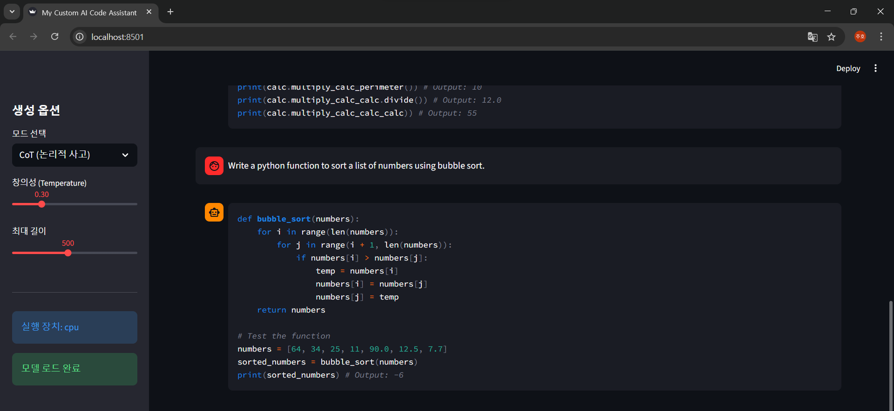
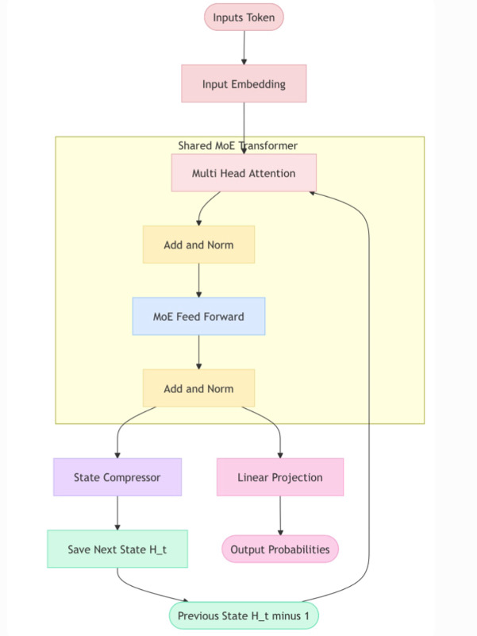

<div align="center">

# 🧠 AICP-Shared-MoE
### Cycle-Shared Mixture-of-Experts Transformer

<!-- 프로젝트 로고가 없다면 스크린샷으로 대체 -->


<br/>
<br/>

<p align="center">
  
  
  
  
  
</p>

<h3>
  "Maximum Intelligence, Minimum Parameters."
</h3>
<p>
  An experimental Transformer architecture combining <b>Weight Sharing</b> with <b>Sparse Mixture-of-Experts</b>.
</p>

</div>

---

## 🧐 Why This Architecture? (The Problem)

Traditional Large Language Models (LLMs) are **Memory Hungry**.
1.  **Redundancy:** Deep networks often learn similar patterns across different layers.
2.  **Dense Computation:** Every neuron fires for every token, wasting compute resources.

**AICP-Shared-MoE solves this by decoupling "Physical" from "Logical" depth:**
> It defines only **3 physical layers** in memory but loops them logically (e.g., 8~12 times) to create a deep network with a fraction of the VRAM. Combined with **MoE**, it activates only a subset of parameters per token.

---

## 🏗️ Core Architecture

The system utilizes a **Cycle-Shared Loop** where data passes through the same physical blocks multiple times, but with different routing decisions via MoE.

<div align="center">
  
</div>


### Key Components
- **Shared Physical Layers:** 3 distinct blocks re-used to achieve 8+ logical layers.
- **Sparse MoE:** 4 Experts per layer, Top-K active routing.
- **Activation:** SwiGLU (Swish-Gated Linear Unit).

---

## ⚠️ Critical Observation: MoE Collapse

During the training of this experimental model, a phenomenon known as **Expert Collapse** was observed.

| Expert ID | Utilization Status | Result |
| :--- | :--- | :--- |
| **Expert 1** | 🔥 Overloaded (99% Usage) | Becomes a "Generalist" but bottlenecks learning. |
| **Expert 2-4** | ❄️ Starved (1% Usage) | "Dead Neurons" - Wasted parameter space. |

> [!NOTE]
> Future iterations will implement **Load Balancing Loss** (auxiliary loss) to force diverse expert usage.

---

## 🛠️ Technical Implementation

### 📂 Directory Structure

```bash
AICP-Shared-MoE/
├── assets/              # Screenshots & Images
├── config/              # Centralized configuration
│   └── config.py        # Model & Training parameters
├── tokenizer/           # Custom BPE Tokenizer
├── app.py               # Streamlit Web Interface (Chat)
├── train.py             # Training Script (Data Pipeline + Loop)            # Parameter Counting & Unit Tests
└── requirements.txt     # Dependencies
```

### 💻 Stack
- **Framework:** PyTorch (AMP Mixed Precision)
- **Data:** flytech/python-codes-25k (HuggingFace)
- **Tokenizer:** Custom BPE (Byte-Level) trained on code.

---

## 🚀 Getting Started

### 1. Prerequisites
- Python 3.8+
- CUDA-enabled GPU (Recommended)

### 2. Installation
```bash
git clone https://github.com/lenftk/AICP-Shared-MoE.git
cd AICP-Shared-MoE
pip install -r requirements.txt
```

### 3. Training (From Scratch)
To train the model on the Python code dataset:
```bash
python train.py
```
This will automatically download the dataset, build the tokenizer, and save weights to `model/best_moe_model.pth`.

### 4. Running the Demo
Launch the interactive web interface:
```bash
streamlit run app.py
```
> [!TIP]
> Ensure your model weights are saved in the `model/` directory as specified in `config/config.py`.

---

## 👨‍💻 Developer

<div align="center">
  <h3>JuHo Min</h3>
  <p><i>Student & Developer</i></p>

  [](mailto:juhomin16@gmail.com)
  [](https://github.com/lenftk)

  *"Exploring the boundaries of efficient AI architectures."*
</div>

---

## License

This project is licensed under the MIT License - see the [LICENSE](LICENSE) file for details.
